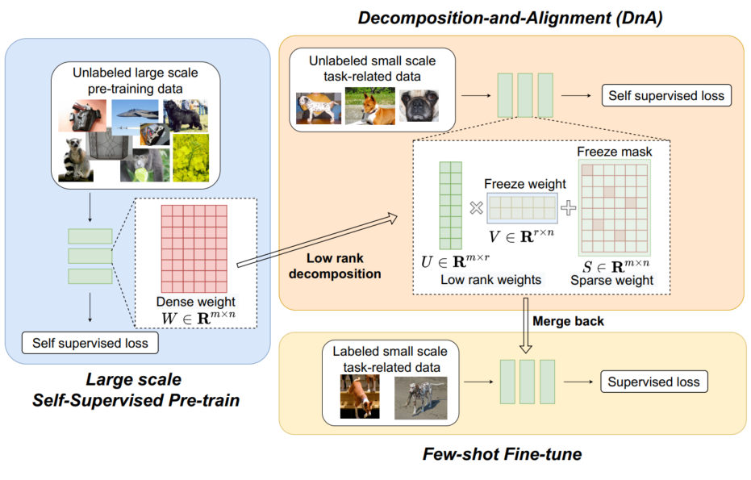

# Improve Few-Shot Transfer Learning with Low-Rank Decompose and Align
## Introduction
Self-supervised (SS) learning has achieved remarkable success in learning strong representation for in-domain few-shot and semi-supervised tasks. However, when transferring such representations to downstream tasks with domain shifts, the performance degrades compared to its supervised counterpart especially at the few-shot regime. 
In this paper, we proposed to boost the transferability of the self-supervised pre-trained models on cross-domain tasks via a novel self-supervised alignment step on the target domain using only unlabeled data before conducting the downstream supervised fine-tuning. A new re-parameterization of the pre-trained weights is also presented to mitigate the potential catastrophic forgetting during the alignment step. It involves low-rank and sparse decomposition, that can elegantly balance between preserving the source domain knowledge without forgetting (via fixing the low-rank subspace), and the extra flexibility to absorb the new out-of-the-domain knowledge (via freeing the sparse residual). Our resultant framework, termed Decomposition-and-Alignment (\textbf{DnA}), significantly improves the few-shot transfer performance of the SS pre-trained model to downstream tasks with domain gaps.

## Method

The overview of the proposed DnA framework. It is applied on top of any self-supervised pre-trained model, to boost its few-shot transfer performance for the downstream tasks on the target data with a domain shift from the pre-training source data.
## Environment requirements
* Python (3.6.4)
* Pytorch (1.7.1)
* opencv
* scikit-learn

Install commands:
```shell
conda install pytorch==1.7.1 torchvision==0.8.2 torchaudio==0.7.2 cudatoolkit=11.0 -c pytorch
pip install opencv-python
pip install -U scikit-learn
```

# Citation
```bash
@inproceedings{jiang2022improve,
  title={Improve Few-Shot Transfer Learning with Low-Rank Decompose and Align},
  author={Jiang, Ziyu and Chen, Tianlong and Chen, Xuxi and Cheng, Yu and Zhou, Luowei and Yuan, Lu and Awadallah, Ahmed and Wang, Zhangyang},
  booktitle={European conference on computer vision},
  year={2022}
}
```
# Acknowledge
Partial code from [Moco](https://github.com/facebookresearch/moco) (official code). 
